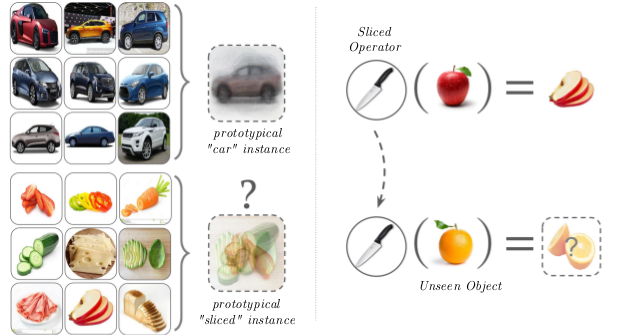

# Ongoing Projects
---
<table class="researchtable">

<tbody>

<tr>
<td class="img">  </td>
<td markdown="span">
**Attributes as Operators**  
We present a new approach to modeling visual attributes and attribute-object composition. We treat objects as vectors and attributes as operators that modify the object vectors to appropriately compose them into a complex concept. Not only does our approach align conceptually with the linguistic role of attributes as modifiers, but it also generalizes to recognize unseen compositions of objects and attributes.  
**[[arXiv]](https://arxiv.org/pdf/???) [[code]](https://github.com/Tushar-N/attributes-as-operators)**
</td>
</tr>

</tbody>
</table>